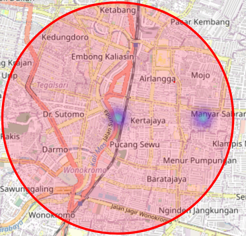

Stack

1. leaflet js https://leafletjs.com/
1. https://github.com/Leaflet/Leaflet.heat
1. i've 0 skill and experience for building front-end so please forgive me for the quality

To Do

1. more dynamic starting point
1. support any json provider

How to use,

1. clone, npm install
1. run vscode live server to deploy
1. create a coordinate and value json in https://jsonbin.io/quick-store/

```
[
  {
    "lat": -7.282103,
    "lng": 112.747903,
    "value": 1400000
  },
  {
    "lat": -7.282103,
    "lng": 112.767903,
    "value": 2000000
  }
]
```

1. put the Access url on your json the left bottom input
1. click anywhere on the map
   the heatmap should be created 
